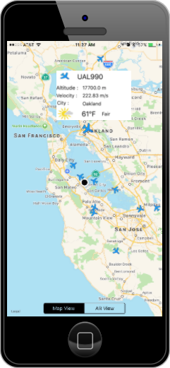

*他の言語で読む: [English](README.md).*

# ARFlightTracker

ARFlightTracker は、SDR/ADSB メッセージ受信局が MQTT サーバーを介してプッシュしたフライト情報を追跡するiOSベースのアプリです。
アプリは、レシーバーの範囲内のポイントからポイントへ移動するすべてのフライトを表示します。
ARFlightTracker アプリケーションは、IBM MQTT サーバーに接続し、新しい/更新されたフライト情報をトピックとして受け取り、それを地図ビューにレンダリングします。
データは、SDR/ADSBメッセージレシーバによってトピックに供給されます。
また地図上では、それぞれの目的地へのフライトが、行先の方向がわかるアニメーションとして表示されます。
フライトの詳細ビューには、そのフライトの現在位置の天気に関するフライト情報が含まれています。

## 地図 (Map) ビュー

地図ビューでは、iOS デバイスに用意されている標準マップ上にすべてのフライトが表示されます。
フライト方向は、ペイロード内の現在の heading 情報に基づいて調整されます
アプリが MQTT メッセージを受信すると、そのフライト情報が目的地に向かって移動するのが見られます。
各フライトをタップすると、飛行番号、高度、距離などの詳細情報が表示されます。
下の図は、iOS デバイス上の Swift ベースのアプリケーションにおける、フライトを表示した地図ビューのレンダリングを示しています:



## AR (Augmented Reality) ビュー

ユーザーは、アプリの `AR View` タブをタップして、AR ベースのビューに切り替えることができます。
このモードでは、アプリはカメラビューになり、利用者が表示されたフライトをポイントすることで、フライトの詳細情報が実際の風景の上にオーバレイで表示されます。
現実世界で飛行機は動いていますので、それに連動して情報を含む吹き出しがカメラビューのフライトと一緒に移動します。
AR ビューには、デバイスの向きに基づくコンパスと、視野角内のすべてのフライトを表示するレーダービューも表示されます。
下の図は、iOS デバイス上の Swift ベースのアプリケーションにおける、フライトを表示した Augmented Reality ビューのレンダリングを示しています:


# 前提条件

 - Swift 3
 - Xcode 8.0+
 - CocoaPod - https://cocoapods.org/
 - iOS 10+


# 依存する要素

 - CocoaMQTT -  ノート: IBM の aphid client から移行
 - SwiftyJSON
 - ios-arkit for iphone - (コードベースの一部)

# 手順:

1. ARFlightTracker-iOS-Swift ディレクトリに移動し、ARFlightTracker-iOS-Swift.xcworkspace を Xcode で開きます。
2. プロジェクトディレクトリから `pod install` を実行します。 これは `Podfile` に定義された依存関係をインストールします。
3. Xcodeエディタを使用して `util/MQTTConnection.swift` を更新します。資格情報を取得するには、IBM Cloud (Bluemix) コンソールで Internet of Things サービスを作成する必要があります。資格情報は次のようになります:
 ```
     API_KEY = "<api-key>"
     API_TOKEN = "<token>"
     IOT_CLIENT = "a:<ORG_ID>:Flights"
     IOT_HOST = "<ORG_ID>.messaging.internetofthings.ibmcloud.com"
     IOT_PORT = 1883 (DEFAULT)
     IOT_TOPIC = "iot-2/type/<DEVICE_TYPE>/id/<DEVICE_ID>/evt/flight/fmt/json"
 ```
4. IBM Weather API の資格情報で `util/RestCall.swift` を更新します。IBM Cloud コンソールを使用して Weather API サービスを作成します:
 ```
    private static let WEATHER_API_USERNAME : String = "<username>"
    private static let WEATHER_API_PASSWORD : String = "<password>"
 ```
5. ビルドして実行します。

# テストモード:

テストモードでアプリを実行すると、IBM Cloud MQTTサーバーとは独立した状態になります。ViewController で、フラグを設定できます:
 ```
 flightTestMode = true
 ```
