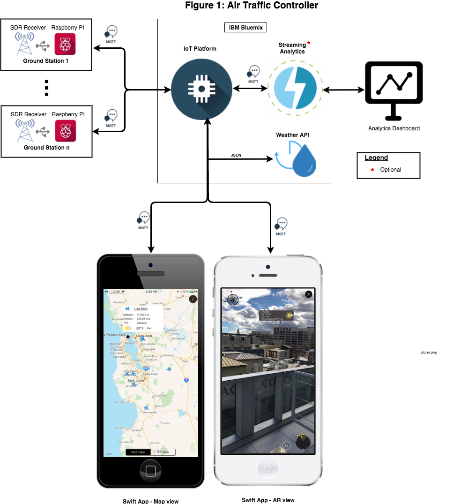
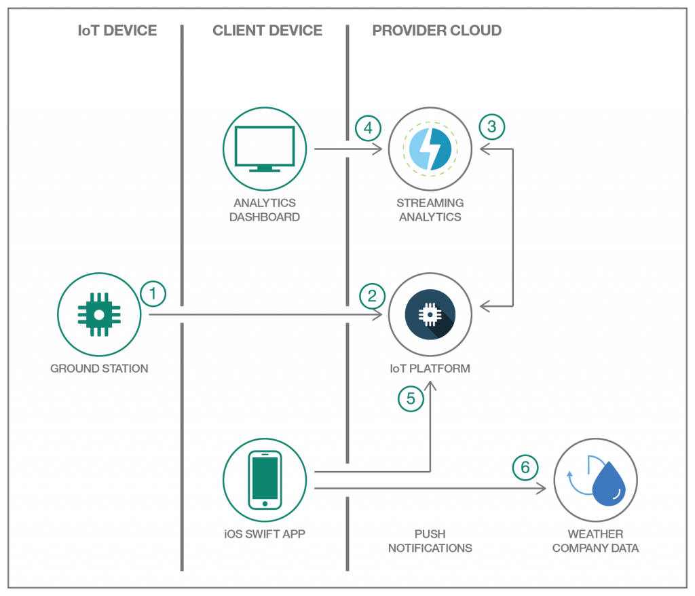

*他の言語で読む: [English](README.md), [中国語](README-cn.md).*

# air-traffic-control (航空交通管制)

このレポジトリには、IBM Cloud を使用して最新の Cloud ベースの航空交通管制を構築するための手順が含まれています。

> ノート: このコードパターンを完全に完成させるには、ラズベリーパイ、アンテナ付き SDR レシーバー、iOS デバイスが必要です。

航空交通管制サービスは、Software Defined Radio (SDR) 搭載の Raspberry Pi で構築した ADS-B 地上局を用いて、民間航空便から直接 ADS-B メッセージを受信します。
そして得られたフライト情報を IBM Cloud で動作する IBM IoT プラットフォームに MQTT メッセージとして発行します。
また、IoT プラットフォームから MQTT メッセージを受信し、Augmented Reality ツールキットを使用してフライトを追跡できる Swift ベースの iOS アプリケーションもサポートしています。
このアプリは、レシーバーの範囲内をを移動するすべてのフライトを表示します。

アビオニクス分野の進歩と Raspberry Pi (RPi) などの安価なコンピューティングリソースの利用により、最先端の地上局を簡単に構築できます。これらの地上局は、Docker などの仮想化技術を使用して複製でき、より大きな領域をカバーできるようになります。世界中に散在する RPi 搭載の地上局は、次のことを行います:

* アンテナを備えたSDR受信機を使用して、高度と見通し線に応じて約 100-150 マイルの飛行に関する情報を受信します。
* ネットワークに接続された IoT デバイスとして機能し、スケーラブルで安全で信頼性が高くオープンなクラウド環境で実行されるクラウドベースの航空交通管制に Message Queuing Telemetry Transport (MQTT) メッセージとしてフライト情報を発行します。

クラウドベースの航空交通管制は、CloudFoundry オープンテクノロジーに基づく IBM の Open Cloud Architecture の実装であり、SoftLayer インフラストラクチャに基づく IBM の Cloud Platform­-As-­A-­Service (PaaS) を使用して実装できます。
地上局はネットワークに接続され、MQTTメッセージとしてフライト情報を送信する IoT デバイスとしてモデル化されているため、IBM Cloud 内で Internet of Things(IoT) Platform サービスを使用することは理にかなっています。
また、それは単に地上局の数をスケールさせるためだけではなく、フライトデータを使用して分析アプリケーション、視覚化ダッシュボードなどを構成できるように、すべてのイベントを受信するためのファネルポイントとして機能します。

また、IoT プラットフォームサービスは、接続されているすべての iOS デバイスにフライト情報を提供することができます。
iOS デバイス上で実行される Swift ベースのモバイルアプリは、拡張現実 (AR: Augmented Reality) を使用して、今見ている実際の景色に重ね合わせて、その方向に向かうフライトをレンダリングすることができます。

## アーキテクチャー

次の図は、安価な地上局を利用して航空便を追跡するクラウドベースの航空交通管制に関するハイレベルのアーキテクチャを示しています。

## アプリケーションのワークフロー

1. 地上局を表す、SDR レシーバー搭載の Raspberry PI が、民間飛行機からの ADS-B メッセージを受信してデコードし、JSON ペイロードを含む MQTT メッセージを IoT Platform にパブリッシュします。
2. 該当するデバイス・タイプとデバイス ID を持つ IoT Platform が MQTT メッセージを受信し、トピックの 1 つ上で使用できるようにします。
3. 必要に応じて、Streaming Analytics サービスが IoT Platform 内のトピックにサブスクライブしてメッセージを処理することもできます。
4. Streaming Analytics サービスからのデータを使用してダッシュボードが作成されます。
5. アプリは IoT Platform 内のトピックにサブスクライブし、Weather Company Data API を呼び出してフライト情報と気象情報を地図および拡張現実ビューにレンダリングします。
6. Weather Company Data Service では、座標を使用して気象データにアクセスするための API を公開しています。

## Raspberry Pi による ADS-B 地上局

Raspberry Pi による ADS-B 地上局を建設するための指示は [こちら](adsb.ground.station/README-ja.md)

## Swift ベースの iOS アプリ

Swift ベースの iOS アプリを使用してフライトを追跡する手順は [こちら](ARFlightTracker-iOS-Swift/README-ja.md) にあります。

# ライセンス

[Apache 2.0](LICENSE)
