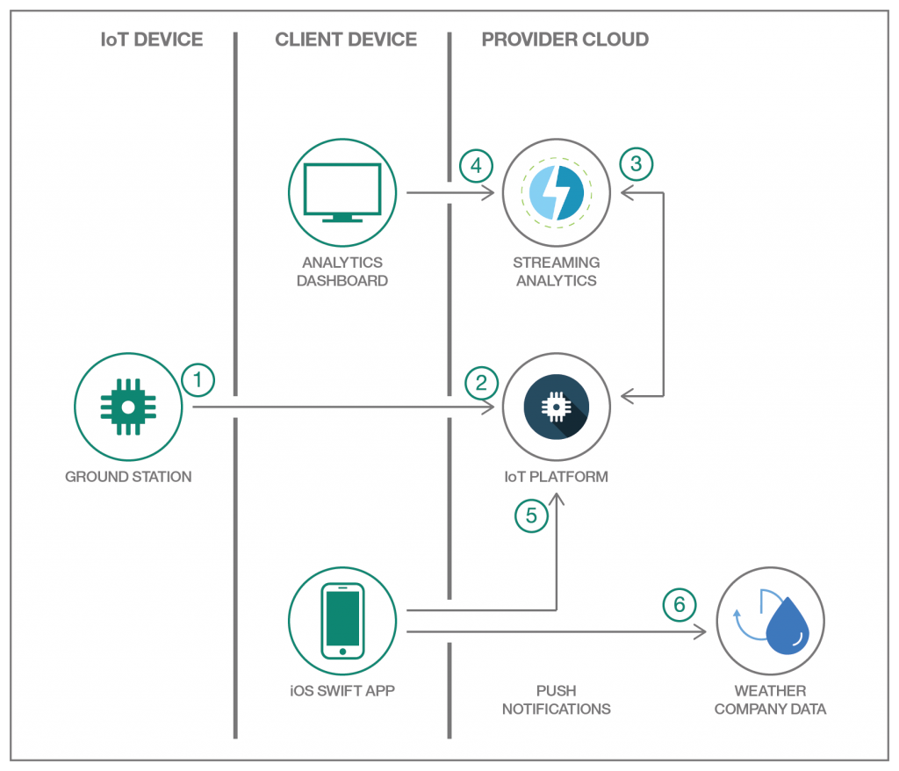

*Read this in other languages: [中国](README-cn.md), [日本](README-ja.md).*

# air-traffic-control

This repository contains instructions to build modern Cloud-based Air Traffic Control using IBM Cloud.

> Note: A Raspberry Pi, SDR receiver with antenna, and an iOS device is required to fully complete this Code Pattern.

The Air Traffic Control Service receives flight information from a Raspberry Pi powered ADS-B Ground Stations with Software Defined Radio(SDR) to receive ADS-B messages directly from commercial flights and publish MQTT messages to the IBM IoT Platform running in IBM Cloud. It also supports a Swift-based iOS app to track flights using the Augmented Reality toolkit by receiving MQTT messages from the IoT Platform. The app will display all the flights traveling point to point within the range of the receiver.

With the advances in the field of avionics and the availability of cheap computing resources such as Raspberry Pi (RPi), one can very easily build a state­ of­ the­ art Ground Station. These Ground Stations can be replicated trivially using virtualization technologies such as Docker to be able to cover large swathes of areas. The RPi­-powered Ground Stations, scattered all over the world, will do the following:
* Use a SDR receiver with an antenna to receive information about flights that are in approximately 100­-150 miles radius depending on the altitude and the line­ of ­sight.
* Act as network­ connected IoT devices to publish the flight information as Message Queuing Telemetry Transport (MQTT) messages to a Cloud­-based Air Traffic Control running in scalable, secure, and, reliable, and open cloud infrastructure.

The Cloud­-based Air Traffic Control can be implemented using IBM's Cloud Platform­-As-­A-­Service (PaaS) which is an implementation of IBM’s Open Cloud Architecture based on CloudFoundry open technology and based on SoftLayer infrastructure. Since the Ground Stations are modeled as IoT devices that are network­ connected and send flight information as MQTT messages, it makes sense to use the Internet of Things(IoT) Platform service within IBM Cloud as it can not only scale elastically with the number of Ground Stations but also serve as funneling point to receive all the events so that one can compose analytics applications, visualization dashboards, etc. using the flight data.

IoT Platform service will also be able to serve the flight information to all the iOS devices that are connected to it. A Swift­-based mobile app running on an iOS device can use Augmented Reality to render flights that are headed in that direction on the screen before they show up outside one’s window!

## Architecture
Following figure shows the high-level architecture of a Cloud-based Air Traffic Control that relies on inexpensive Ground Stations to track flights

## Application Workflow

1. Raspberry Pi streams airtraffic data to IoT Platform
2. MQTT streams data to IoT Analytics dashboard for analysis
3. Current weather is pulled from the Weather Service API
4. Analytics and weather data are sent to phone device

## Raspberry Pi powered ADS-B Ground Station

The instructions for building a Raspberry Pi powered Ground Station are [here](https://github.com/IBM/air-traffic-control/blob/master/adsb.ground.station/README.md).

## Swift-based iOS App

The instructions for tracking flights using Swift-based iOS app are [here](https://github.com/IBM/air-traffic-control/blob/master/ARFlightTracker-iOS-Swift/README.md).

# License

This code pattern is licensed under the Apache Software License, Version 2. Separate third party code objects invoked within this code pattern are licensed by their respective providers pursuant to their own separate licenses. Contributions are subject to the Developer [Certificate of Origin, Version 1.1 (“DCO”)] (https://developercertificate.org/) and the [Apache Software License, Version 2]( (http://www.apache.org/licenses/LICENSE-2.0.txt).

ASL FAQ link: http://www.apache.org/foundation/license-faq.html#WhatDoesItMEAN
