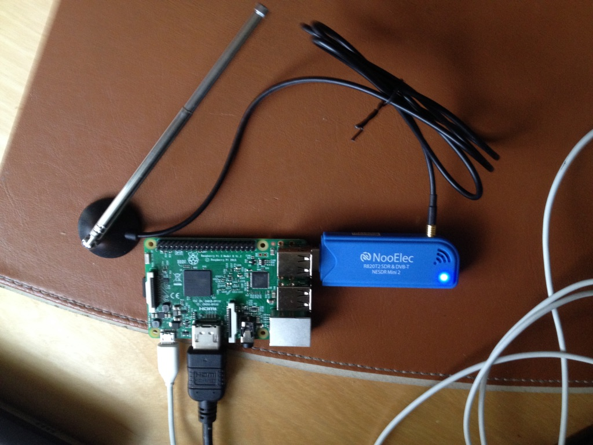

*他の言語で読む: [English](README.md).*

# adsb.ground.station (ADS-B 地上局)

以下を実施する商用フライトのための Raspberry Pi による ADS-B 地上局です:

 * _受信 (receives)_ : 1090MHz の周波数にチューニングされた Software-Defined Radio (SDR)デバイスを使用して、商用フライトによって放送される [Automatic Dependent Surveillance-Broadcast(ADS-B)](http://airfactsjournal.com/2013/01/ads-b-101-what-it-is-and-why-you-should-care/) メッセージを受信します。
 * _復号 (decodes)_ : 商用フライトからの ADS-B メッセージを復号します。
 * _発行 (publishes)_ : IBM Cloud (Bluemix) の [Internet of Things(IoT) Platform](https://console.ng.bluemix.net/catalog/services/internet-of-things-platform/?taxonomyNavigation=applications) に合致する [MQTT](http://mqtt.org/) メッセージを発行します。

IBM Bluemix Cloud からの MQTT メッセージは、座標に基づいてデバイスに送信され、デバイスの近くのフライトを追跡することができます。
拡張現実 (AR: Augmented Reality) を使用した iOS のフライト追跡アプリの詳細は、こちらの [README](../ARFlightTracker-iOS-Swift/README-ja.md) を参照してください。

USB2.0 インターフェースをサポートする [NooElec's RTL-SDR receiver set with antenna](http://www.nooelec.com/store/sdr/sdr-receivers/nesdr-mini-2-plus.html) などの SDR デバイスは、適切な半径内であれば、商用飛行機によって平文で放送されているADS-Bメッセージを受信するために、USBポートを備えた任意のデバイスから実用的に使用することができます。

この練習の一環として、[NooElec's RTL-SDR receiver set with antenna](http://www.nooelec.com/store/sdr/sdr-receivers/nesdr-mini-2-plus.html) を接続した Raspberry Pi 3 は、商用フライトからの ADS-B メッセージを受信してデコードするだけでなく、対応する MQTT メッセージをIBM Cloud (Bluemix) IoT プラットフォームに公開するためにも使用されました。

以下のセクションでは、Raspberry Pi 3 をセットアップして、IBM Cloud上の商業フライトについての情報を公開できるようにする方法について詳しく説明します。このような Raspberry Pi による ADS-B 地上局は、世界中の航空機の 100-150 マイルの飛行を追跡することができます。IBM Cloud 上で先進的な航空交通管制を作成することで、現在の航空交通管制で使用されている時代遅れのレーダー技術を置き換えることが可能かもしれません。

## ハードウェア要件

 * Raspberry Pi 3 と 32GB 以上の容量の SD カード
 * [NooElec's RTL-SDR receiver set with antenna](http://www.nooelec.com/store/sdr/sdr-receivers/nesdr-mini-2-plus.html) のような SDR デバイス

## ソフトウェア要件

前述のハードウェアに加えて、`adsb.ground.station` には以下のソフトウェアが必要です:

 * RTL-SDR USB ドライバー
 * SDR デバイスを 1090MHz の周波数に同調させ、データを収集し、それをポート `30002` から利用可能にする [Dump1090](https://github.com/MalcolmRobb/dump1090) デコーダ
 * Java SE Development Kit (JDK) 8 以上
 * Maven 3.2.5 以上

## Raspberry Pi 3 を設定する

新しい Raspberry Pi 3 を設定するのに役立つ多くのリソースがあります。この練習では、[こちら](https://www.raspberrypi.org/documentation/installation/noobs.md) で説明されている、32GB SDカードに配置した _New Out Of Box Software_ (NOOBS) を使用しました。

## ハードウェアを設定する

「百聞は一見に如かず」なので、ここではハードウェアの設定方法を示す画像を示します:



設定を完了するまでの手順は次のとおりです:

* [NooElec's RTL-SDR receiver dongle](http://www.nooelec.com/store/sdr/sdr-receivers/nesdr-mini-2-plus.html) にアンテナを接続します。
* NooElec's RTL-SDR receiver を Raspberry Pi の USB ポートに接続します。
* マイクロ USB ポートを使用して Raspberry Pi 3 の電源を入れます。

これでおしまい！ RTL-SDR receiver から ADS-B メッセージを受信する前に、Raspberry Pi 3 に `Dump1090 Server` という専用のソフトウェアをビルド、インストール、実行する必要があります。

`Dump1090 Server` をビルドして実行するには2つのオプションがあります。
[Dockerfile](Dockerfile) を使って、Docker コンテナに `Dump1090 Server` をビルドして実行するのに必要なすべてのソフトウェアが入っている Docker イメージを作成することもできますし、`Dump1090 Server` をラズベリーパイ3に直接インストールすることもできます。
以下のセクションでは、これらのアプローチの両方の手順を示します。

## Raspberry Pi 3 上の Docker コンテナで Dump1090 Server をビルドし実行する

このリポジトリの一部である [Dockerfile](Dockerfile) を使用すると、Raspberry Pi 3 上で動作する Docker コンテナ内で `Dump1090 Server` をビルドして実行するのに必要なすべてのソフトウェアを含む Docker イメージを作成できます。

これを達成するための手順は次のとおりです:

### Raspbian 環境を最新にする

```
$ sudo apt-get update
$ sudo apt-get upgrade
$ sudo apt-get dist-upgrade
```

### Raspberry Pi 3 に Docker をインストールする

Docker を Raspberry Pi 3 にインストールして設定する手順は [こちら](http://blog.alexellis.io/getting-started-with-docker-on-raspberry-pi/)。

### Dump1090 Server のための Docker イメージを作成する

```
$ git clone https://github.com/IBM/air-traffic-control
$ cd air-traffic-control/adsb.ground.station
$ docker build -t dump1090:1.0 .
```

Docker イメージが準備できたら、次のコマンドを使って `dump1090` の `image-id` を取得できます:

```
$ docker images dump1090
```

### Docker コンテナと Dump1090 Server を開始する

`Dump1090 Server` の Docker イメージが作成されたら、Docker コンテナを起動することができます。
Docker コンテナは内部的に `Dump1090 Server` を起動します。
前のステップで取得した `image-id` を使ってコンテナを起動する手順は次のとおりです:

```
$ docker run -d --privileged -v /dev/bus/usb:/dev/bus/usb -p 30002:30002 <image_id>
```
このコマンドは指定されたイメージを使用してコンテナのプロセスを開始し、`container_id` をターミナルに表示します。

商用フライトから放送され、SDR から `Dump1090 Server` によって受信されている ADS-B メッセージのログを見るために、次のコマンドを使ってコンテナに接続することができます:

```
$ docker attach <container_id>
```

## Raspberry Pi 3 上で直接 Dump1090 Server をビルドし実行する

このセクションでは、Docker を使用したくない場合に、必要なドライバと他のソフトウェアを Raspberry Pi 3 に直接インストールし、商用フライトから ADS-B メッセージを SDR で受信するための `Dump1090 Server` をビルドして実行する手順を詳しく説明します。

Raspberry Pi 3 には HDMI ポートがあり、ディスプレイに接続することができます。
ヘッドレスモードでも、他のマシンからの `ssh` で使うことができます。
どちらのオプションを選択しても、実行する手順は次のとおりです。

### Raspbian 環境を最新にする
```
$ sudo apt-get update
$ sudo apt-get upgrade
$ sudo apt-get dist-upgrade
```

### Build Essentials をインストールする
```
$ sudo apt-get install build-essential
```

### Utils をインストールする
```
$ sudo apt-get install apt-utils
$ sudo apt-get install usbutils
$ sudo apt-get install pkg-config
```

### `cmake` をインストールする
```
$ sudo apt-get install cmake
```

### ドライバーのビルドに必要な USB ライブラリをインストールする
```
$ sudo apt-get install libusb-1.0-0-dev
```

### git をインストールする
```
$ sudo apt-get install git-core git
```

### RTL-SDR ドライバーをビルドしてインストールする
```
$ cd ~
$ git clone git://git.osmocom.org/rtl-sdr.git
$ cd ~/rtl-sdr
$ cmake ./ -DINSTALL_UDEV_RULES=ON -DDETACH_KERNEL_DRIVER=ON
$ make
$ sudo make install
$ sudo ldconfig
```

### [Dump1090 Server](https://github.com/MalcolmRobb/dump1090) をビルドする
```
$ cd ~
$ git clone https://github.com/MalcolmRobb/dump1090
$ cd ~/dump1090
$ make
```

Raspberry Pi 3 は、ADS-B地上局になる準備が整いました！
以下に示すように、USBポートに接続された SDR デバイスが Raspberry Pi 3 によって認識されているかどうかを確認します。

```
$ lsusb
Bus 001 Device 005: ID 0bda:2838 Realtek Semiconductor Corp. RTL2838 DVB-T
Bus 001 Device 003: ID 0424:ec00 Standard Microsystems Corp. SMSC9512/9514 Fast Ethernet Adapter
Bus 001 Device 002: ID 0424:9514 Standard Microsystems Corp.
Bus 001 Device 001: ID 1d6b:0002 Linux Foundation 2.0 root hub
```

### Dump1090 Server を実行する

`Dump1090 Server` は以下のように開始できます:

```
$ cd ~/dump1090
$ ./dump1090 --raw --net
```

デフォルトでは、`Dump1090 Server` は SDR を 1090MHz の周波数にチューニングし、`30002` ポートでクライアントからの TCP 接続を待ち受けます。
接続されたすべてのクライアントは、生の ADS-B メッセージを受信します。

`adsb.ground.station` は、`Dump1090 Server` に接続して生の ADS-B メッセージを受信し、ADS-B メッセージを復号し、対応する MQTT メッセージを IBM Cloud の IoT プラットフォームに発行する TCP クライアントとして動作します。

## IBM IoT プラットフォームへのデバイス登録と API キーの生成

このプロジェクトは IBM Cloud で実行されている IoT プラットフォームに MQTT メッセージを送信するので、IoTプラットフォームのダッシュボードから、 [レシピ](https://developer.ibm.com/recipes/tutorials/how-to-register-devices-in-ibm-iot-foundation/) に従って、次のことを実施します:

* デバイスタイプとデバイス ID を登録する
* アプリケーションの API キーと対応する認証トークンを生成する

登録されたデバイスには、独自の認証トークンが割り当てられます。
ただしこの練習では、アプリの認証トークンを使用する **のみ** になります。

前述の手順を完了したら、次の情報が必要です:

 * Organization-ID=[あなたの組織 ID]
 * API-Key=[あなたのアプリの API キー]
 * Authentication-Token=**[あなたのアプリの認証トークン]**
 * Device-Type=[あなたのデバイスタイプ]
 * Device-ID=[あなたのデバイス ID]

この情報は、このプロジェクト/リポジトリを使用して実行可能な jar をビルドする **前に**、 `application.properties` ファイルを更新する、次の一連のステップで使用されます。

## このプロジェクトをビルドする

このプロジェクトをビルドするための最小要件は次のとおりです:

* Java SE Development Kit (JDK) 8 以上: Raspbian イメージの一部として標準でインストールされます
* Maven 3.2.5 以上

このプロジェクトは Raspberry Pi 3 上で直接ビルドすることもできますが、通常のラップトップ/デスクトップ上で構築し、実行可能な jar ファイルを Raspberry Pi 3 にコピーすることをお勧めします。
これは Raspberry Pi 3 ではリソースが限られているからです。
通常のラップトップ/デスクトップでこのプロジェクトをビルドすることで、Maven リポジトリを作成します。

## このプロジェクトをビルドする手順
```
$ cd ~
$ git clone --recursive https://github.com/IBM/air-traffic-control
$ cd air-traffic-control
```
前の手順で取得した情報で adsb.ground.station/src/main/resources/application.properties ファイルを更新します。
これを行わないと、起動時に java.io.IOException が発生します。
```
$ mvn clean install
```

`adsb.ground.station/target` フォルダには、`src/main/resources/application.properties` ファイルに詳細を記載した IoT プラットフォームサービスを対象として設定された、実行可能な jar ファイル `adsb.ground.station-develop-SNAPSHOT.jar` が生成されています。

## `adsb.ground.station` クライアントを実行する

### Raspberry Pi 3 上の Dump1090 Server と共存させる

実行可能な jar がいったんビルドされたら、Raspberry Pi 3 で実行するのは非常に簡単です:

```
$ cd air-traffic-control/adsb.ground.station/target
$ java -cp . -jar adsb.ground.station-develop-SNAPSHOT.jar
```

このコマンドを実行する前に `Dump1090 Server` が起動していることを確認しておいてください。

### クライアントとサーバーを別のホストで実行する

`Dump1090 Server` and `adsb.ground.station` client can run on a separate hosts. For example, `Dump1090 Server` can run on Raspberry Pi 3 and the `adsb.ground.station` client can run on your laptop with additional command-line parameters as shown below:

`Dump1090 Server` と `adsb.ground.station` クライアントは、別々のホスト上で実行させることができます。たとえば、 `Dump1090 Server` は Raspberry Pi 3 上で動作させ、`adsb.ground.station` クライアントはラップトップ上で以下のような追加のコマンドラインパラメータを使って実行できます:

```
$ cd air-traffic-control/adsb.ground.station/target
$ java -cp . -jar adsb.ground.station-develop-SNAPSHOT.jar --host 192.168.1.10 --port 30002
```

192.168.1.10 は `Dump1090 Server` が動作している Raspberry Pi 3 のIPアドレスです。

このコマンドを実行する前に `Dump1090 Server` が起動していることを確認しておいてください。

### SDR をシミュレートする

SDR や Raspberry Pi を所有していない場合は、ラップトップから `adsb.ground.station` クライアントを実行して、フライト追跡の仕組みを確認することができます。クライアントは、ADS-B メッセージをキャッシュしており、このメッセージは San Jose 地区で1時間の間にキャプチャされたもので、継続的に再生されます。`Dump1090 Server` を使わずにクライアントを走らせるには、以下のようにします:

```
$ cd air-traffic-control/adsb.ground.station/target
$ java -cp . -jar adsb.ground.station-develop-SNAPSHOT.jar --simulate-sdr
```
