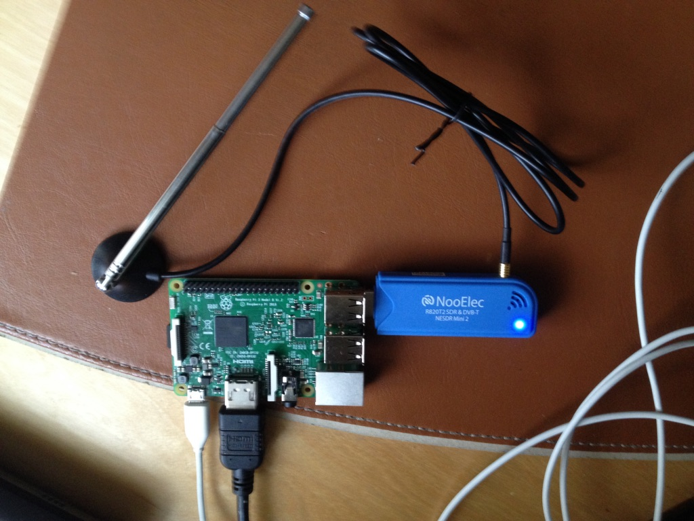

*Read this in other languages: [日本](README-ja.md).*

# adsb.ground.station

Raspberry Pi powered Ground Station for commercial flights that does the following:

 * _receives_ [Automatic Dependent Surveillance-Broadcast(ADS-B)]
 (http://airfactsjournal.com/2013/01/ads-b-101-what-it-is-and-why-you-should-care/) messages
 broadcasted by commercial flights using a Software-Defined Radio(SDR) device tuned to 1090 MHz
 frequency
 * _decodes_ ADS-B messages from commercial flights
 * _publishes_ corresponding [MQTT](http://mqtt.org/) messages to [Bluemix Internet of Things(IoT) Platform]
 (https://console.ng.bluemix.net/catalog/services/internet-of-things-platform/?taxonomyNavigation=applications)
 in IBM's Bluemix Cloud.

The MQTT messages from the IBM Bluemix Cloud can then be transmitted over to devices, based on their
coordinates, to be able to track flights in the vicinity of the device. Details of iOS flight tracking
app using Augmented Reality are in it's own [README.md](../ARFlightTracker-iOS-Swift/README.md).

SDR devices such as [NooElec's RTL-SDR receiver set with antenna]
(http://www.nooelec.com/store/sdr/sdr-receivers/nesdr-mini-2-plus.html), which support USB 2.0
interface, can be used to receive ADS-B messages that are being broadcasted in clear text by
commercial flights, within a decent radius, on practically any device with a USB port.

As part of this exercise, a Raspberry Pi 3 along with [NooElec's RTL-SDR receiver set with antenna]
(http://www.nooelec.com/store/sdr/sdr-receivers/nesdr-mini-2-plus.html) were used to not only
receive ADS-B messages from commercial flights and decode them but also to publish corresponding
MQTT messages to IBM Bluemix IoT Platform.

The following sections describe in great detail how to set up Raspberry Pi 3 so that it can publish
information about commercial flights in it's vicinity over IBM Bluemix. One can imagine a whole bunch
of such Raspberry Pi powered ADS-B Ground Stations that can track aircraft in 100-150mile radius
scattered all over the world publishing messages to create modern Air Traffic Controls in
IBM Bluemix and perhaps replacing the out-dated radar technology that is currently used by the
conventional Air Traffic Controls.

## Hardware Requirements
 * Raspberry Pi 3 with at least 32GB SD card
 * SDR device such as [NooElec's RTL-SDR receiver set with antenna]
 (http://www.nooelec.com/store/sdr/sdr-receivers/nesdr-mini-2-plus.html)

## Software Requirements
In addition to the aforementioned hardware, `adsb.ground.station` requires the following software:

 * RTL-SDR USB driver
 * [Dump1090](https://github.com/MalcolmRobb/dump1090) decoder that tunes the SDR device to 1090MHz
 frequency, collects the data, and makes it available on port `30002`.
 * Java SE Development Kit (JDK) 8 or higher
 * Maven 3.2.5 higher

## Getting Raspberry Pi 3 Ready
There are a lot of resources that can help you with getting your brand new Raspberry Pi 3 ready. For
this exercise, the _New Out Of Box Software_(NOOBS) on a 32GB SD card was used as described
[here](https://www.raspberrypi.org/documentation/installation/noobs.md).

## Configuring the Hardware
Since a picture is worth a thousand words, here is the picture that shows how the hardware needs to
be configured:



Here are the steps to accomplish the configuration:

 * Attach the antenna to the [NooElec's RTL-SDR receiver dongle]
 (http://www.nooelec.com/store/sdr/sdr-receivers/nesdr-mini-2-plus.html).
 * Plug in NooElec's RTL-SDR receiver into the Raspberry Pi's USB port.
 * Power up Raspberry Pi 3 using the micro-USB port.

That's it! Before we can receive ADS-B messages from RTL-SDR receiver, we have to build, install,
and run specialized software called `Dump1090 Server` on Raspberry Pi 3.

There are two options to build and run `Dump1090 Server`. You can either use the
[Dockerfile](Dockerfile) to create a Docker image that would in turn contain all the necessary
software to build and run `Dump1090 Server` in a Docker container or you can install the software
that let's you build and run `Dump1090 Server` directly on your Raspberry Pi 3. The following
sections provide steps for both of these approaches.

## Using Docker on Raspberry Pi 3 to build and run Dump1090 Server

Using the [Dockerfile](Dockerfile) that is part of this repository, you can create a Docker image
that would contain all the necessary software to build and run `Dump1090 Server` from within the
Docker container running on Raspberry Pi 3.

Here are the steps to accomplish this:

### Upgrade to the latest Raspbian image
```
$ sudo apt-get update
$ sudo apt-get upgrade
$ sudo apt-get dist-upgrade
```

### Install Docker on Raspberry Pi 3
Instructions to install and configure Docker on Raspberry Pi 3 are
[here](http://blog.alexellis.io/getting-started-with-docker-on-raspberry-pi/).

### Create Docker Image for Dump1090 Server

```
$ git clone https://github.com/IBM/air-traffic-control
$ cd air-traffic-control/adsb.ground.station
$ docker build -t dump1090:1.0 .
```

Once the Docker image is ready, you can retrieve the `image-id` for `dump1090`, using the following command:

```
$ docker images dump1090
```

### Start Docker Container and Dump1090 Server

Once the Docker image for `Dump1090 Server` has been created, you can start a Docker container. The
Docker container will launch `Dump1090 Server` internally. Here is the step to start the container using `image-id` from the previous command:

```
$ docker run -d --privileged -v /dev/bus/usb:/dev/bus/usb -p 30002:30002 <image_id>
```
This command will use the specified image to start a container process and print the `container_id`
in the Terminal.

In order to see the log of ADS-B messages broadcasted by the commercial flights that are being
received by the `Dump1090 Server` from the SDR, you can attach to the container using the following
command:

```
$ docker attach <container_id>
```

## Building and Running Dump1090 Server directly on Raspberry Pi 3

If you don't want to use Docker, then this section describes in detail all the steps that you should
perform to install the necessary drivers and other software directly on Raspberry Pi 3 to be able to
build and run `Dump1090 Server` that would allow the SDR to receive ADS-B messages from the commercial
flights.

Raspberry Pi 3 comes with a HDMI port that can be used to connect a display. You can also use it in
headless mode and `ssh` from your other machine. Regardless of which option you choose, here are the
sequence of steps that you should perform:


### Upgrade to the latest Raspbian image
```
$ sudo apt-get update
$ sudo apt-get upgrade
$ sudo apt-get dist-upgrade
```

### Install Build Essentials
```
$ sudo apt-get install build-essential
```

### Install Utils
```
$ sudo apt-get install apt-utils
$ sudo apt-get install usbutils
$ sudo apt-get install pkg-config
```

### Install `cmake`
```
$ sudo apt-get install cmake
```

### Install USB library needed to build drivers
```
$ sudo apt-get install libusb-1.0-0-dev
```

### Install git
```
$ sudo apt-get install git-core git
```

### Build and Install RTL-SDR Drivers
```
$ cd ~
$ git clone git://git.osmocom.org/rtl-sdr.git
$ cd ~/rtl-sdr
$ cmake ./ -DINSTALL_UDEV_RULES=ON -DDETACH_KERNEL_DRIVER=ON
$ make
$ sudo make install
$ sudo ldconfig
```

### Build [Dump1090 Server](https://github.com/MalcolmRobb/dump1090)
```
$ cd ~
$ git clone https://github.com/MalcolmRobb/dump1090
$ cd ~/dump1090
$ make
```

Now your Raspberry Pi 3 is ready to be a ADS-B Ground Station! You can confirm whether the SDR
device connected to the USB port is being recognized by Raspberry Pi 3 as shown below:

```
$ lsusb
Bus 001 Device 005: ID 0bda:2838 Realtek Semiconductor Corp. RTL2838 DVB-T
Bus 001 Device 003: ID 0424:ec00 Standard Microsystems Corp. SMSC9512/9514 Fast Ethernet Adapter
Bus 001 Device 002: ID 0424:9514 Standard Microsystems Corp.
Bus 001 Device 001: ID 1d6b:0002 Linux Foundation 2.0 root hub
```

### Run Dump1090 Server

`Dump1090 Server` can be started as shown below:

```
$ cd ~/dump1090
$ ./dump1090 --raw --net
```

By default, `Dump1090 Server` will tune the SDR to 1090MHz frequency and listen for client TCP
connections on port `30002`. All the connected clients will receive the raw ADS-B messages.

`adsb.ground.station` will act as TCP client that will connect to the `Dump1090 Server` to
receive raw ADS-B messages, decode the ADS-B messages, and publish corresponding MQTT messages
to IoT Platform in IBM Bluemix Cloud.

## Registering Device and Generating API Key with IBM IoT Platform
Since this project will be sending MQTT messages to the IoT Platform running in IBM Bluemix Cloud,
follow the steps in this
[recipe](https://developer.ibm.com/recipes/tutorials/how-to-register-devices-in-ibm-iot-foundation/)
from within the IoT Platform's dashboard to do the following:
 * Register a device-type and device-id
 * Generate API Key and the corresponding Authentication Token for the app

Note that the registered device will have it's own Authentication Token. However, in this exercise,
we will be **only** using the the Authentication Token of the app.

You should have the following information when you are done with the aforementioned steps:

 * Organization-ID=[Your Organization ID]
 * API-Key=[Your Apps' API-Key]
 * Authentication-Token=**[Your Apps' Authentication Token]**
 * Device-Type=[Your Device Type]
 * Device-ID=[Your Device ID]

This information will be used in the next set of steps when updating `application.properties` file
**before** building the executable jar using this project/repo.

## Building this project
Minimum requirements for building this project are:

 * Java SE Development Kit (JDK) 8 or higher: Installed by default as part of Raspbian image
 * Maven 3.2.5 or higher

Even though this project can be built directly on Raspberry Pi 3, it is advisible to build it on a
regular laptop/desktop and then copy over the executable jar to Raspberry Pi 3. This is because
Raspberry Pi 3 has limited resources and you can avoid creating the Maven repository on it by
building this project on a regular laptop/desktop.

## Steps for building this project
```
$ cd ~
$ git clone --recursive https://github.com/IBM/air-traffic-control
$ cd air-traffic-control
  Update adsb.ground.station/src/main/resources/application.properties file using the information obtained from the
  earlier step. Failure to do this will result in java.io.IOException during startup.
$ mvn clean install
```

The `adsb.ground.station/target` folder will contain the executable jar
`adsb.ground.station-develop-SNAPSHOT.jar` specifically targeted for the IoT Platform service
and the device whose details are specified in `src/main/resources/application.properties` file.

## Running `adsb.ground.station` Client

### Co-located with Dump1090 Server on Raspberry Pi 3

Once the executable jar is built, running it on Raspberry Pi 3 is very simple:

```
$ cd air-traffic-control/adsb.ground.station/target
$ java -cp . -jar adsb.ground.station-develop-SNAPSHOT.jar
```

Make sure that the `Dump1090 Server` is up and running before running the aforementioned command.

### Client and Server Running on Separate Hosts

`Dump1090 Server` and `adsb.ground.station` client can run on a separate hosts. For example,
`Dump1090 Server` can run on Raspberry Pi 3 and the `adsb.ground.station` client can run on your
laptop with additional command-line parameters as shown below:

```
$ cd air-traffic-control/adsb.ground.station/target
$ java -cp . -jar adsb.ground.station-develop-SNAPSHOT.jar --host 192.168.1.10 --port 30002
```

where 192.168.1.10 is the IP address of the Raspberry Pi 3 on which `Dump1090 Server` is running.

Make sure that the `Dump1090 Server` is up and running before running the aforementioned command.

### Simulate SDR

If you don't have a SDR or a Raspberry Pi, you can still run `adsb.ground.station` client from your
laptop to see how the flight tracking works. The client has cached ADS-B messages, which were
captured over a period of an hour from San Jose area, and plays them continually. To run the client
without `Dump1090 Server`, you can do the following:

```
$ cd air-traffic-control/adsb.ground.station/target
$ java -cp . -jar adsb.ground.station-develop-SNAPSHOT.jar --simulate-sdr
```
